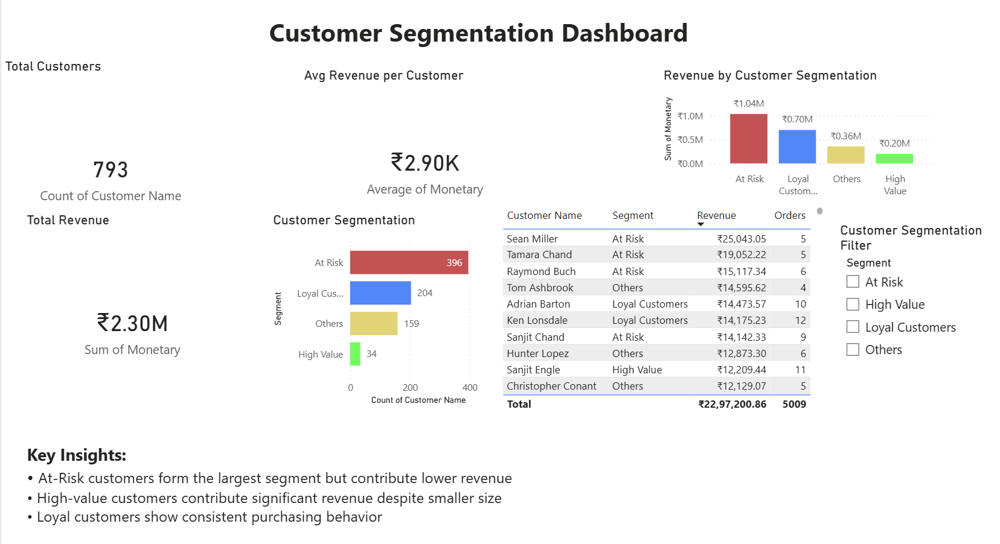

# Customer Segmentation & RFM Analysis

## 📊 Project Overview
This project performs customer segmentation using RFM (Recency, Frequency, Monetary) analysis to identify high-value, loyal, and at-risk customers. The goal is to generate actionable business insights to support data-driven decision-making.

---

## 🚀 Tools & Technologies
- Python (Pandas, NumPy)
- SQL (for data aggregation)
- Power BI (for dashboard visualization)

---

## 📂 Dataset
- Superstore dataset (Kaggle)

---

## ⚙️ Project Workflow
1. Data Cleaning using Python
2. SQL used to aggregate customer-level metrics:
   - Frequency (number of orders)
   - Monetary (total spending)
   - Last purchase date
3. Recency calculated using Python
4. RFM scoring applied to segment customers
5. Dashboard built in Power BI

---

## 📈 Key Insights
- At-risk customers form the largest segment but contribute lower revenue
- High-value customers contribute significant revenue despite smaller size
- Loyal customers show consistent purchasing behavior

---

## 📊 Dashboard Preview

---

## 💡 Conclusion
This project demonstrates how customer segmentation can help businesses identify valuable customers, improve retention strategies, and optimize marketing efforts.

---

## 🔗 Author
Chhaveesh Agnihotri
